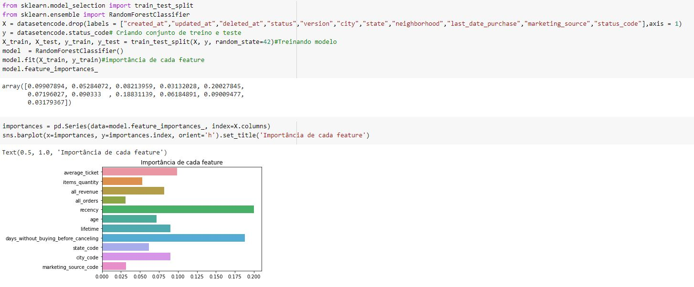

# CasePetLove

# leitura e tratamento de dados

## Imports Necessários
Começamos o projeto importando as bibliotecas necessárias para ler e explorar os dados disponibilizados.

## leitura do dataset
logo em seguida usamos o pandas para fazer a leitura do arquivo juntamente com a biblioteca requests para não precisar baixar o arquivo e fazer a leitura de forma local

## tratamento do dataset
Alguns tratamentos que julguei necessarios como conversão de textos em datas e criação de novas features que não continham no data set original tais como idade e o total de dias que um cliente ficou sem realizar compra antes de cancelar a assinatura.

## encoder de variáveis categóricas
Alguns dados importantes vieram como labels, utilizei o label enconder da biblioteca scikit-learn para realizar o encoder dessas variaveis e criei uma copia do dataset

# análise exploratória

## Primeira análise 
Verificando o balancemento do dataset em relação ao status

## Segunda análise 
Em busca de alguma discrepância nos dados de "Marketing Source"

## terceira análise 
Plot de gráficos das 8 variáveis de medida por status, na tentativa de encontrar algum dado sobressaltante nessas medidas

Após o plot dos gráficos ficou claro que o total de dias sem comprar antes do cancelamento é um dos pontos importantes

## Quarta análise
Utilizando seaborn para plotar um mapa de calor com as correlações das features, que exibiu as medidas "Recency" e "days_without_buying_before_canceling" com a maior correlação com o "Status"

## Quinta análise
Criação de um modelo utilizando RandomForestClassifier para plotar um gráfico com as features mais importantes do dataset

